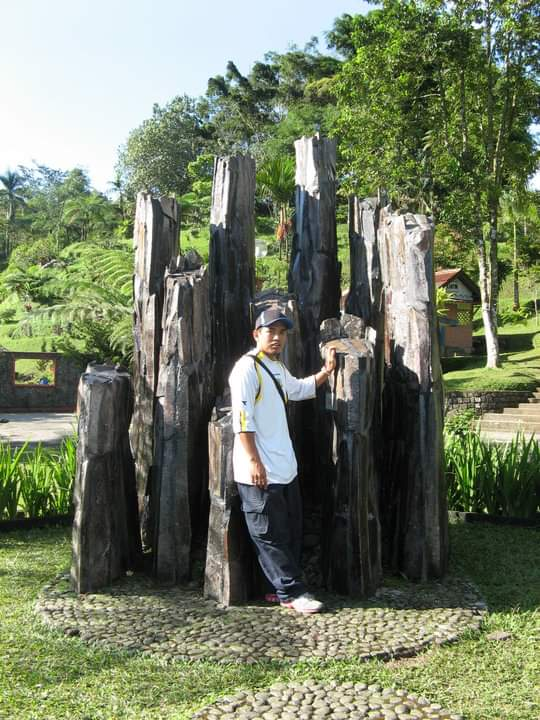

```{r metathis, echo=FALSE}
library(metathis)
meta() %>%
  meta_name("github-repo" = "DrJohan/drjohancv") %>% 
  meta_social(
    title = "Johan Ibrahim CV",
    description = paste(
      "CV made with the packages RMarkdown, pagedown, datadrivencv."
    ),
    url = "https://drjohan.github.io/drjohancv/index.html",
    image = "https://beatrizmilz.github.io/resume/img/share-card.png",
    image_alt = paste(
      "Beatriz Milz CV"
    ),
    og_type = "website",
    og_author = "Johan Ibrahim",
    twitter_card_type = "summary_large_image",
    twitter_creator = "@DrJohan81"
  )
```
<!-- start academic icons -->
<link rel="stylesheet" href="https://cdn.jsdelivr.net/gh/jpswalsh/academicons@1/css/academicons.min.css">
<!-- final academic icons -->

 
<!-- start font awesome -->
<script src="https://kit.fontawesome.com/e82584e357.js" crossorigin="anonymous"></script>

 
<!-- final font awesome -->

```{r, include=FALSE}
knitr::opts_chunk$set(
  results='asis', 
  echo = FALSE
)

library(magrittr) # For the pipe
source("cv_printing_functions_johan.r")

# Read in all data and initialize a CV printer object
CV <- create_CV_object(
  data_location = "https://docs.google.com/spreadsheets/d/1_Y3HPpenl9Q0rovGZUmto6kxSCrtv8BsTGSfdk-xdXk/edit#gid=917338460",  
  pdf_mode = params$pdf_mode
)

CV$entries_data <- CV$entries_data %>% dplyr::filter(in_resume == TRUE)

```


```{r}
# When in pdf export mode the little dots are unaligned, so fix that with some conditional CSS.
if(params$pdf_mode) {
    cat("
<style>
:root{
  --decorator-outer-offset-left: -6.5px;
}
</style>")
}
```


Aside
================================================================================
{width=%}


```{r}
if(params$pdf_mode){
  cat("View this CV online with links at _drjohan.github.io/drjohancv/index.html")
} else {
  cat("[<i class='fas fa-download'></i> Download a PDF of this CV](https://github.com/DrJohan/drjohancv/johan_cv.pdf)")
}
```

Contact {#contact}
--------------------------------------------------------------------------------

```{r}
CV %>% print_contact_info()
```


Programming Skills {#skills}
--------------------------------------------------------------------------------

```{r}
CV %>% print_skill_bars()
```


Research Skills {#software}
--------------------------------------------------------------------------------
<i class="fas fa-viruses"></i> `Infectious Disease Modelling`

<i class="fas fa-file-medical-alt"></i> `Scientific Literature Review`

<i class="far fa-chart-bar"></i> `Regression Analysis`

<i class="far fa-chart-bar"></i> `Time to Event Analysis`

<i class="far fa-hospital"></i> `Experimental Design and Analysis`

<i class="fas fa-disease"></i> `Basic and Advance Epidemiology`

<i class="fas fa-brain"></i> `Articial Intelligence`

<i class="fas fa-mortar-pestle"></i> `Study Design`


Disclaimer {#disclaimer}
--------------------------------------------------------------------------------

Made with the R package [**pagedown**](https://github.com/rstudio/pagedown). 

The source code is available <i class="fa fa-github"></i> [Github](https://github.com/DrJohan/drjohancv).

Last updated on `r Sys.Date()`. The most recent version of this CV is [available here](drjohan.github.io/drjohancv/)


Main
================================================================================

Johan Ibrahim {#title}
--------------------------------------------------------------------------------

```{r}
# Note the special double pipe so we modify the CV object in place
CV %<>% print_text_block("intro") 
```


Education {data-icon=graduation-cap data-concise=true}
--------------------------------------------------------------------------------

```{r}
CV %<>% print_section('education')
```


Selected Short Courses Attended {data-icon=book} 
--------------------------------------------------------------------------------

```{r}
CV %<>% print_section('short_courses')
```


Research Experience {data-icon=laptop}
--------------------------------------------------------------------------------
::: aside
```{r}
CV %<>% print_text_block('research_experience_aside')
```
:::
```{r}
CV %<>% print_section('research_projects')
```


Industry Experience {data-icon=suitcase}
--------------------------------------------------------------------------------

::: aside
```{r}
CV %<>% print_text_block('industy_experience_aside')
```
:::

```{r}
CV %<>% print_section('working_experience')
```

<!-- These breaks just force a new page so section doesnt get cut off -->
<br>
<br>
<br>

Teaching Experience {data-icon=chalkboard-teacher}
--------------------------------------------------------------------------------

::: aside
```{r}
CV %<>% print_text_block('teaching_experience_aside')
```
:::

```{r}
CV %<>% print_section('teaching_positions')
```


Selected Data Science Writing {data-icon=chart-line}
--------------------------------------------------------------------------------

::: aside
```{r}
CV %<>% print_text_block('data_science_writing_aside')
```
:::

```{r}
CV %<>% print_section('data_science_writings')
```


Selected Events organized {data-icon=calendar-check}
--------------------------------------------------------------------------------

```{r}
CV %<>% print_section('event_attended')
```


<br>
<br>


Selected Publications, Posters, and Talks {data-icon=book}
--------------------------------------------------------------------------------

```{r}
CV %<>% print_section('academic_articles')
```


```{r}
CV %<>% print_links()
```

